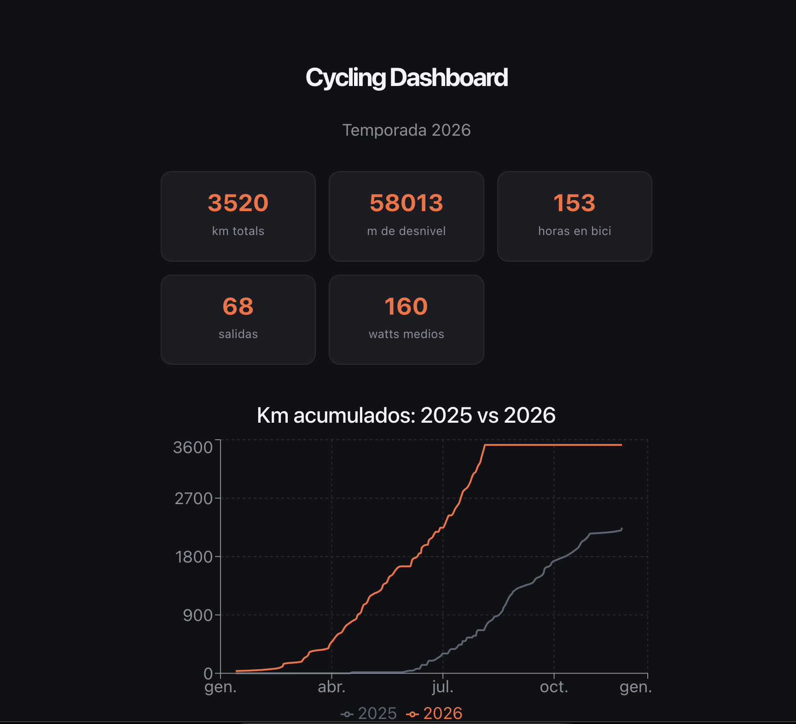
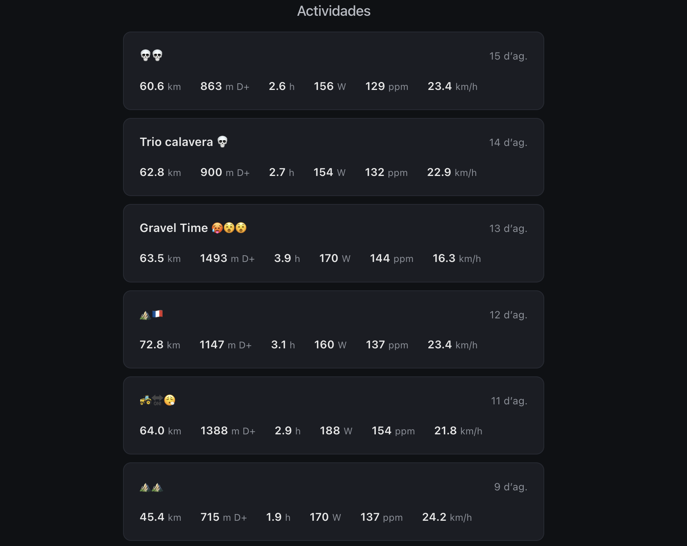
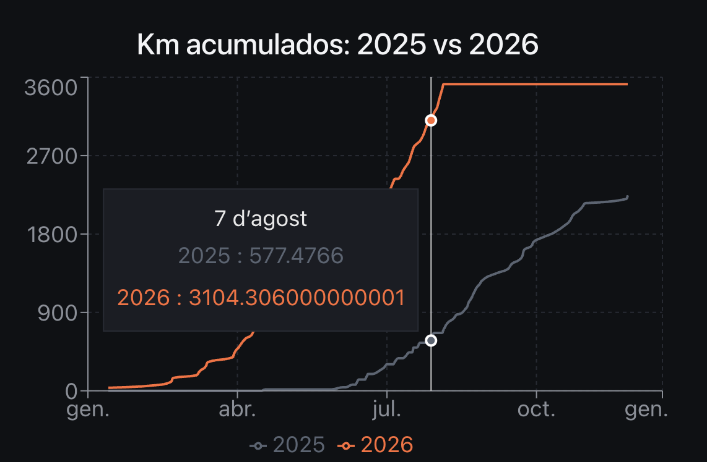

# Cycling Performance Dashboard

Dashboard personal para analizar mis datos de entrenamiento de ciclismo, 
conectándome directamente a la API de Strava. Proyecto realizado para 
aprender data engineering de principio a fin: desde la extracción de 
datos hasta su visualización.

[Ver el dashboard en directo](#) ← *(pendiente de desplegar)*

## Capturas
- Vista Inicio:

- Vista Actividades:

- Vista Gráfico:


## Qué hace

- Se conecta a la API de Strava mediante OAuth2
- Descarga todas las actividades de ciclismo
- Procesa y limpia los datos con pandas (conversión de unidades, tipos de datos)
- Muestra un dashboard con KPIs de la temporada, comparativa de km 
  acumulados año actual vs año anterior, y el detalle de cada salida

## Stack técnico

**Backend / Data pipeline**
- Python
- Strava API (OAuth2)
- pandas

**Frontend**
- React + Vite
- Recharts (gráficos)

## Sobre el desarrollo

Este proyecto lo he hecho como ejercicio de aprendizaje de data engineering, 
viniendo de un fondo de ingeniería informática.

- El **backend** (autenticación OAuth2, consumo de la API de Strava, 
  procesamiento de datos con pandas) lo he programado yo mismo, entendiendo 
  cada parte del proceso.
- Para el **frontend** (React), aprendí los conceptos fundamentales 
  (componentes, state, props, hooks) haciendo ejercicios paso a paso, y 
  usé asistencia de IA para acelerar la implementación del diseño 
  visual final y los gráficos.

## Cómo ejecutarlo en local

### Requisitos
- Python 3.9+
- Node.js
- Una cuenta de Strava con una aplicación API registrada 
  ([strava.com/settings/api](https://www.strava.com/settings/api))

### Backend

```bash
python3 -m venv venv
source venv/bin/activate
pip install -r requirements.txt
```

Crea un archivo `.env` en la raíz con:

```
CLIENT_ID=tu_client_id
CLIENT_SECRET=tu_client_secret
REFRESH_TOKEN=tu_refresh_token
```
### Frontend

```bash
cd dashboard
npm install
npm run dev
```

Esto ejecuta automáticamente el pipeline de datos y arranca el servidor 
de desarrollo en `http://localhost:5173`.